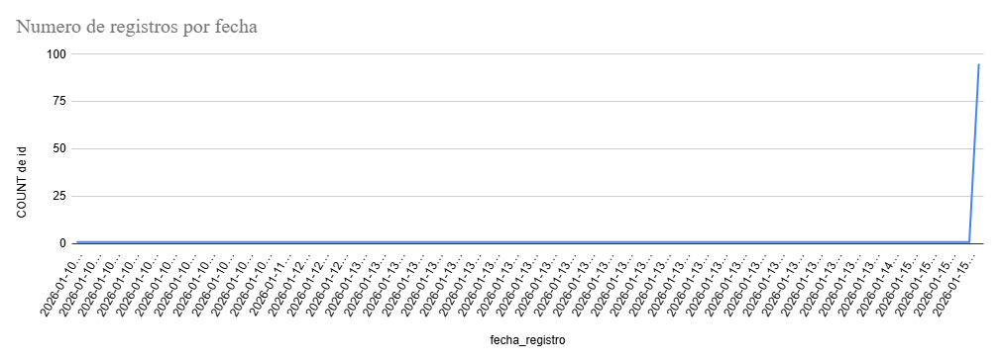
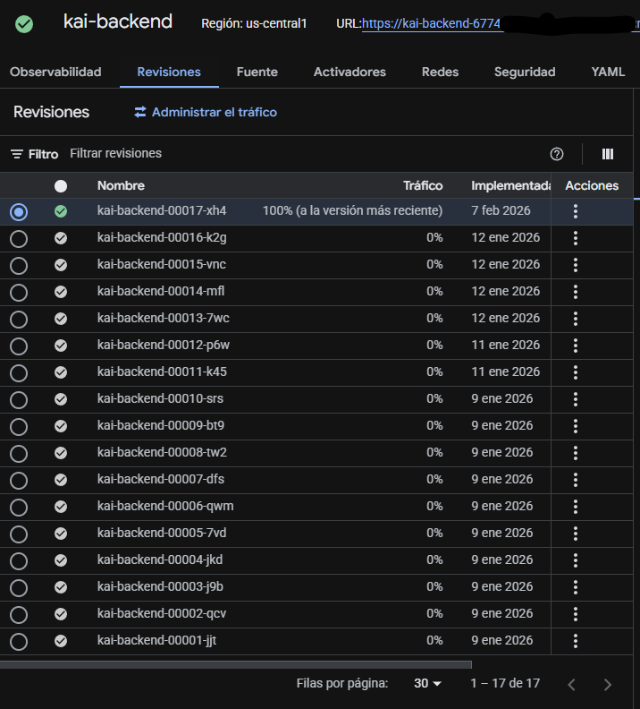

# KAI - Kairos Artificial Intelligence

<div align="center">


### 🎓 Tu Asistente Académico Inteligente para la USAC

**Plataforma web con IA que automatiza la planificación académica universitaria: genera horarios sin choques, analiza carga académica y predice notas necesarias para alcanzar tu promedio objetivo.**

[🚀 Demo en Vivo](https://kaiusac.netlify.app) · [📖 Documentación Backend](./Backend/) · [📖 Documentación Frontend](./Frontend/) · [🐛 Reportar Bug](https://github.com/tu-usuario/kai/issues)

</div>

---

## 💭 La Historia detrás de KAI

### El Problema

En la Facultad de Ingeniería de la USAC, cada semestre miles de estudiantes enfrentan el mismo caos: **la página oficial de cursos solo muestra una tabla gigante con +1000 secciones de todas las carreras**, sin filtros inteligentes, sin generador de horarios, sin forma de visualizar si tu carga académica es balanceada.

Los estudiantes pasan **horas manualmente** cruzando horarios en Excel, preguntando a compañeros mayores, arriesgándose a inscribir "horarios suicidas" con 3 cursos difíciles que los llevan al abandono. No hay herramienta que les ayude a tomar decisiones informadas sobre su semestre.

### La Solución

**KAI nació como respuesta a este problema.** No es solo un proyecto técnico: es una herramienta de **ayuda social** diseñada por estudiantes, para estudiantes.

Imagina poder decirle al sistema: *"Quiero llevar estos 6 cursos, trabajo los lunes de 2-6pm, y quiero que mi horario no tenga choques"*. KAI genera **5 opciones óptimas** en segundos, considerando prerrequisitos, dificultad de cursos y tu disponibilidad.

O poder preguntar: *"¿Qué notas necesito sacar en mis cursos actuales para cerrar con 85 de promedio?"*. El sistema calcula exactamente cuánto necesitas en cada curso.

O simplemente preguntar a un chatbot académico: *"¿Qué prerrequisitos tiene Compiladores?"* y obtener respuesta instantánea, sin buscar en PDFs de 200 páginas.

**Eso es KAI.** Tu compañero inteligente para sobrevivir y thrive en ingeniería.

---

## 🎯 ¿Qué Resuelve KAI?

| Problema del Estudiante | Solución KAI | Tecnología |
|-------------------------|--------------|------------|
| "No sé qué cursos puedo llevar juntos sin que se choquen" | **Generador de Horarios** que genera 5 opciones sin conflictos | Algoritmos Genéticos |
| "No sé si mi carga de cursos es muy difícil para este semestre" | **Semáforo de Carga Académica** que clasifica cursos en Verde/Amarillo/Rojo | K-Means Clustering |
| "No sé qué notas necesito para alcanzar mi promedio objetivo" | **Optimizador de Promedio** que calcula notas necesarias curso por curso | Linear Optimization (SciPy) |
| "No recuerdo los prerrequisitos de este curso" | **Chatbot Académico** que responde preguntas sobre el pensum | TF-IDF + NLP |
| "No sé cuánto progreso llevo en mi carrera" | **Dashboard** con créditos, promedio, avance y próxima clase | Visualización interactiva |

---

## ✨ Características Principales

### 🧬 3 Motores de Inteligencia Artificial

#### 1. Semáforo de Carga Académica (K-Means Clustering)
Clasifica automáticamente cada curso del pensum en 3 niveles de dificultad usando 4 features: créditos, semestre, prerrequisitos y análisis semántico de palabras clave. Te alerta si estás armando un "horario suicida".

```
Resultado: {
  "semaforo": "amarillo",
  "mensaje": "Carga Pesada: 2 difíciles y varios medios",
  "cursos_por_nivel": {1: 2, 2: 2, 3: 1}
}
```

#### 2. Generador de Horarios (Algoritmos Genéticos)
Motor evolutivo que genera combinaciones óptimas de horarios sin choques. Evoluciona una población de 70 individuos durante 30 generaciones con:
- **Cromosoma**: Array de paquetes (Teoría + Lab) por curso
- **Fitness**: Score basado en cursos tomados, peso estratégico, perfil de usuario (relax/normal/tryhard)
- **Selección**: Elitismo (top 15 sobreviven) + cruza + mutación
- **Restricciones**: 0 choques horarios, límite de cursos por promedio

Integra análisis financiero de costo de oportunidad: si dejas un curso crítico fuera, te muestra cuántos meses podría retrasar tu graduación.

#### 3. Optimizador de Promedio (Goal Seeking)
Calcula las notas mínimas necesarias en cursos actuales para alcanzar un promedio objetivo ponderado. Usa optimización con restricciones (SciPy SLSQP):
- **Función objetivo**: Minimizar varianza entre notas (distribución equitativa)
- **Restricción**: Suma ponderada ≥ puntos necesarios
- **Bounds**: Notas entre 61 (aprobar) y 100
- **Escenarios**: Pesimista (61), Realista (75), Optimista (90), Perfecto (100)

### 🤖 Chatbot Académico (NLP Local)
Asistente conversacional basado en intents + TF-IDF + cosine similarity que opera 100% local sin APIs externas:
- Detección de intención (15+ intents: prerrequisitos, créditos, búsqueda, semestre, etc.)
- Extracción de entidades (código o nombre de curso)
- Contexto personalizado (historial de aprobados del usuario)
- Soporte multi-carrera (10 carreras de ingeniería USAC)

### 📊 Visualizaciones Interactivas
- **Gráficos Recharts**: Pie, Bar, Line, Radar, RadialBar charts
- **Grafo de Fuerza SVG**: Simulación física custom (300 ticks) para visualizar dependencias del pensum
- **Three.js 3D Particles**: Landing page con canvas animado
- **Calendario Semanal**: Posicionamiento absoluto por minutos (Lun-Sáb)

### 🎨 Diseño Glassmorphism
Sistema de diseño moderno con:
- Tarjetas con `backdrop-blur-xl` y bordes semi-transparentes
- Dark mode completo
- Animaciones con Framer Motion
- Responsive mobile-first

### 🔐 Seguridad
- Validación XSS/SQLi en cliente y servidor
- Hash SHA-256 de passwords
- Sanitización de inputs
- CORS configurado
- Rate limiting por plan (free/daily/premium)

---

## 🏗️ Arquitectura del Sistema

```
┌─────────────────────────────────────────────────────────────┐
│                     Netlify CDN (Frontend)                   │
│                    kaiusac.netlify.app                        │
│                  React 19 + Vite 7 + Tailwind              │
└─────────────────────────┬───────────────────────────────────┘
                          │ HTTPS REST API
                          ▼
┌─────────────────────────────────────────────────────────────┐
│              Google Cloud Run (Backend)                      │
│                  Flask + Gunicorn :8080                      │
│                                                              │
│  ┌──────────────────────────────────────────────────────┐  │
│  │              6 Routers (Blueprints)                   │  │
│  │   auth │ courses │ schedules │ academic │ chatbot │ plan │  │
│  └──────────────────────────────────────────────────────┘  │
│                          │                                    │
│  ┌──────────────────────────────────────────────────────┐  │
│  │           3 Motores de Inteligencia Artificial        │  │
│  │                                                       │  │
│  │  • K-Means Clustering (scikit-learn)                 │  │
│  │  • Algoritmos Genéticos (custom)                     │  │
│  │  • Linear Optimization (SciPy SLSQP)                 │  │
│  │  • TF-IDF + Cosine Similarity (NLP)                  │  │
│  └──────────────────────────────────────────────────────┘  │
│                          │                                    │
│  ┌──────────────────────────────────────────────────────┐  │
│  │                    Data Layer                         │  │
│  │  • PostgreSQL (Cloud SQL) - Usuarios, cursos, planes │  │
│  │  • Google Cloud Storage - Fotos de perfil            │  │
│  │  • CSV Files - +1000 cursos de 10 carreras USAC      │  │
│  └──────────────────────────────────────────────────────┘  │
└─────────────────────────────────────────────────────────────┘
```

---

## 🛠️ Stack Tecnológico

### Backend
| Categoría | Tecnología | Propósito |
|-----------|-----------|-----------|
| **Framework** | Python 3.11 + Flask 3.1 | API REST, Blueprints |
| **Machine Learning** | scikit-learn | K-Means Clustering, TF-IDF |
| **Optimización** | SciPy | Linear Optimization (SLSQP) |
| **Data Science** | Pandas + NumPy | Manipulación de datasets |
| **NLP** | NLTK + difflib | Tokenización, fuzzy matching |
| **OCR** | Tesseract + Pillow | Extracción de texto de imágenes |
| **Base de Datos** | PostgreSQL (Cloud SQL) | Persistencia en producción |
| **Storage** | Google Cloud Storage | Imágenes de perfil |
| **Deploy** | Docker + Cloud Run | Containerización serverless |
| **Servidor** | Gunicorn | WSGI server (1 worker, 8 threads) |

### Frontend
| Categoría | Tecnología | Propósito |
|-----------|-----------|-----------|
| **Framework** | React 19 | UI component-based |
| **Build Tool** | Vite 7 + SWC | Dev server HMR + build |
| **CSS** | TailwindCSS 3.4 | Utility-first + dark mode |
| **Animaciones** | Framer Motion 12 | Transiciones, gestos |
| **Routing** | React Router DOM 7 | SPA routing + protected routes |
| **Gráficos 2D** | Recharts 3 | Pie, Bar, Line, Radar charts |
| **Gráficos 3D** | Three.js + R3F | Partículas 3D landing |
| **PDF Export** | jsPDF + html2canvas | Descarga de horarios |
| **CSV Parsing** | PapaParse | Lectura de pensums |
| **Iconos** | Lucide React | Iconografía tree-shakable |
| **Deploy** | Netlify | CI/CD desde GitHub |

---

## 🚀 Impacto y Arquitectura de Producción

- **Lanzamiento:** Enero - Febrero 2026
- **Tráficos y Registros:** +80 usuarios registrados en las primeras 48 horas tras el despliegue.
- **Backend:** Google Cloud Run (Serverless, Containerized con gcloud, auto-scaling de 0 a 3 instancias).
- **Frontend:** Netlify (Desplegado desde repositorio GitHub).

<details>
<summary>📊 Ver métricas de registro y evidencia de infraestructura</summary>

### Crecimiento de Registros (Enero 2026)


### Despliegue en Google Cloud Run


</details>

---

## 📦 Estructura del Proyecto

```
KAI - Kairos Artificial Intelligence/
│
├── Backend/                              # API REST Flask + IA
│   ├── main.py                          # Entry point Flask
│   ├── config.py                        # Config global, DB adapter, singletons IA
│   ├── routers/                         # 6 Blueprints (auth, courses, schedules, academic, chatbot, plan)
│   ├── clustering_semaforo.py           # IA: K-Means para clasificar dificultad
│   ├── optimizador_promedio.py          # IA: Goal Seeking con SciPy
│   ├── motor_generador.py               # AG: Generador de horarios automáticos
│   ├── motor_custom.py                  # AG: Generador de horarios personalizados
│   ├── chatbot_academico.py             # NLP: Chatbot con TF-IDF + intents
│   ├── analisis_competencias.py         # NLP: Clasificación de competencias
│   ├── financiero.py                    # Análisis de costo de oportunidad
│   ├── storage.py                       # Google Cloud Storage con fallback local
│   ├── Data/                            # Datasets (10 pensums CSV + oferta cursos)
│   ├── Dockerfile                       # Deploy en Cloud Run
│   └── requirements.txt                 # Dependencias Python
│
├── Frontend/                             # SPA React + Vite
│   ├── src/
│   │   ├── pages/                       # 14 páginas (Dashboard, Semáforo, Optimizador, Chatbot, etc.)
│   │   ├── components/                  # ~30 componentes (UI, landing, dashboard, modals)
│   │   ├── api/                         # API config (env-aware)
│   │   └── App.jsx                      # Router + rutas protegidas
│   ├── package.json                     # Dependencias Node.js
│   ├── tailwind.config.js               # Tema custom (pastel palette, dark mode)
│   └── vite.config.js                   # Vite + SWC
│
└── README.md                            # Este archivo
```

---

## 🔥 Casos de Uso Reales

### Caso 1: Estudiante que trabaja
*"Trabajo los lunes de 2-6pm. Quiero llevar 6 cursos sin que se choquen con mi trabajo."*

**KAI:**
1. Filtra todas las secciones que conflicten con tu horario laboral
2. Ejecuta algoritmo genético con restricción de trabajo
3. Genera 5 opciones óptimas en segundos
4. Muestra análisis financiero: si dejas un curso crítico, te dice cuántos meses retrasa tu graduación

### Caso 2: Estudiante que quiere mejorar promedio
*"Tengo 78 de promedio. ¿Qué necesito sacar en mis 4 cursos actuales para cerrar con 85?"*

**KAI:**
1. Calcula tu promedio actual ponderado
2. Determina puntos necesarios para alcanzar 85
3. Usa optimización lineal para distribuir notas equitativamente
4. Te dice: "Necesitas 87 en Física 2, 84 en Álgebra, 86 en Programación 3, 85 en Ética"
5. Simula escenarios: Pesimista (61), Realista (75), Optimista (90), Perfecto (100)

### Caso 3: Estudiante que no sabe qué cursos llevar
*"No sé si puedo llevar Compiladores, Redes y Sistemas Operativos juntos."*

**KAI:**
1. Verifica prerrequisitos de los 3 cursos
2. Clasifica dificultad con K-Means: Compiladores (Rojo), Redes (Amarillo), Sistemas Operativos (Rojo)
3. Analiza combinación: "🔴 Carga Pesada: 2 cursos difíciles y 1 medio. Requiere mucha disciplina."
4. Sugiere: "Considera mover uno de los cursos Rojos al próximo semestre."

### Caso 4: Estudiante que pregunta al chatbot
*"¿Qué prerrequisitos tiene Inteligencia Artificial?"*

**KAI (Chatbot):**
1. Detecta intent: `prerrequisitos`
2. Extrae entidad: `Inteligencia Artificial` (código 0771)
3. Busca en base de conocimiento: "Programación 2, Estructuras de Datos, Lógica"
4. Responde: "📚 Inteligencia Artificial (0771)\n📋 Prerrequisitos:\n  - 0147: Programación 2\n  - 0150: Estructuras de Datos\n  - 0112: Lógica"

---

## 🏁 Instalación Rápida

### Backend
```bash
cd Backend
python -m venv venv
source venv/bin/activate  # Windows: venv\Scripts\activate
pip install -r requirements.txt
python inicializar_db.py
python main.py
```
Backend corriendo en `http://localhost:8000`

### Frontend
```bash
cd Frontend
npm install
echo "VITE_API_URL=http://localhost:8000" > .env.local
npm run dev
```
Frontend corriendo en `http://localhost:5173`

### Base de Datos
- **Desarrollo**: SQLite (automático, archivo `usuarios.db`)
- **Producción**: PostgreSQL (Cloud SQL, configurado con `DATABASE_URL`)

---

## 🎓 Modelo de Suscripción

| Feature | Free | Day Pass (Q10/24h) | Premium (Q25/mes) |
|---------|------|-------------------|-------------------|
| Chatbot IA | 5/día | Ilimitado | Ilimitado |
| Generador Manual | 3/semestre | Ilimitado | Ilimitado |
| Generador IA | No | Ilimitado | Ilimitado |
| OCR (escaneo imágenes) | 1/mes | Ilimitado | Ilimitado |
| Vista Pensum Grafo | No | Si | Si |
| Simulador Escenarios | No | Si | Si |
| Exportar PDF | No | Si | Si |

---

## 🌟 Características Destacadas para Reclutadores

### Ingeniería de Software
- **Arquitectura Full-Stack**: Frontend SPA + Backend REST API + IA integrada
- **Cloud Native**: Deploy en Google Cloud Run (serverless, auto-scaling, containerizado)
- **CI/CD**: Frontend desplegado automáticamente desde GitHub a Netlify
- **Base de Datos Dual**: SQLite (dev) / PostgreSQL (prod) con adapter pattern
- **Seguridad**: Validación XSS/SQLi en cliente y servidor, hash de passwords, CORS, sanitización

### Inteligencia Artificial y Machine Learning
- **3 Motores de IA**: K-Means Clustering, Algoritmos Genéticos, Optimización Lineal
- **NLP Local**: Chatbot con TF-IDF + cosine similarity (sin APIs externas)
- **OCR**: Extracción de texto de imágenes con Tesseract
- **Análisis Predictivo**: Goal seeking para predicción de notas
- **Simulación de Fuerza**: Grafo interactivo con física custom (Coulomb + Hooke)

### Experiencia de Usuario
- **Diseño Moderno**: Glassmorphism, dark mode, animaciones fluidas
- **Responsive**: Mobile-first con layouts adaptativos
- **Visualización de Datos**: 6 tipos de gráficos interactivos + 3D
- **Performance**: Lazy loading, caching de modelos IA, polling optimizado
- **Accesibilidad**: Formularios validados, feedback visual, modales accesibles

### Escalabilidad y Producción
- **Serverless**: Auto-scaling de 0 a 3 instancias según demanda
- **Multi-tenant**: Soporte para múltiples usuarios con datos aislados
- **Rate Limiting**: Control de uso por plan (free/daily/premium)
- **Storage Escalable**: Google Cloud Storage para archivos estáticos
- **Monitoreo**: Logs estructurados, manejo de errores global

---

## 🤝 Contribuciones

Este proyecto fue desarrollado como trabajo independiente de la facultad de Ingeniería de la USAC. Si eres estudiante de la facultad y quieres contribuir:

- 💡 Sugiere nuevas features
- 📚 Ayuda a mejorar la documentación
- 🎨 Propone mejoras de diseño

---

## 📄 Licencia

Este proyecto fue desarrollado con fines educativos y de ayuda social para la comunidad estudiantil de la Facultad de Ingeniería - USAC.

---

## 📧 Contacto

**¿Preguntas o sugerencias?**

- 🌐 Demo: [kaiusac.netlify.app](https://kaiusac.netlify.app)
- 📖 Documentación Backend: [Backend/](./Backend/)
- 📖 Documentación Frontend: [Frontend/](./Frontend/)
- 🌐 Correo: martin1aleman@proton.me 

---

<div align="center">

**Hecho con 💙 por estudiantes, para estudiantes de la USAC**

*Si este proyecto te ayudó, considera darle una ⭐ al repositorio*

</div>
