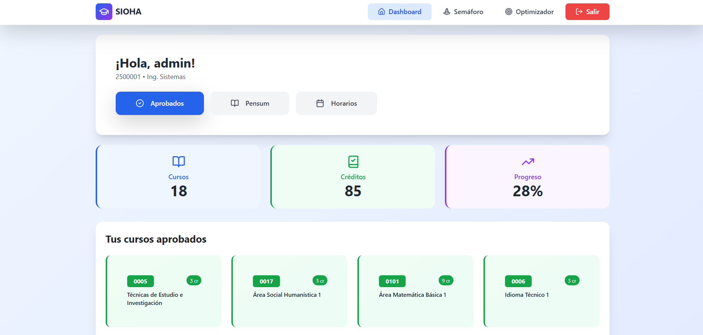
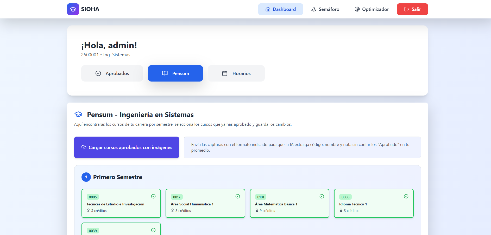
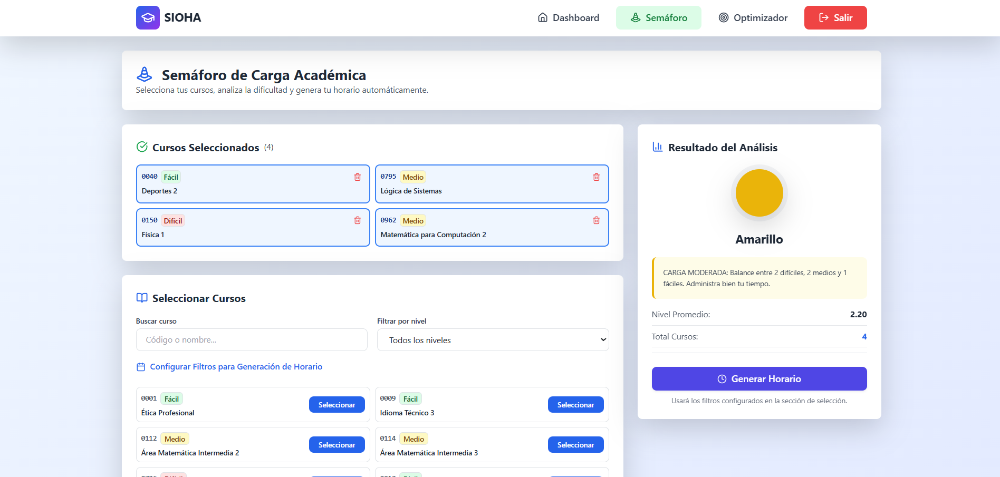
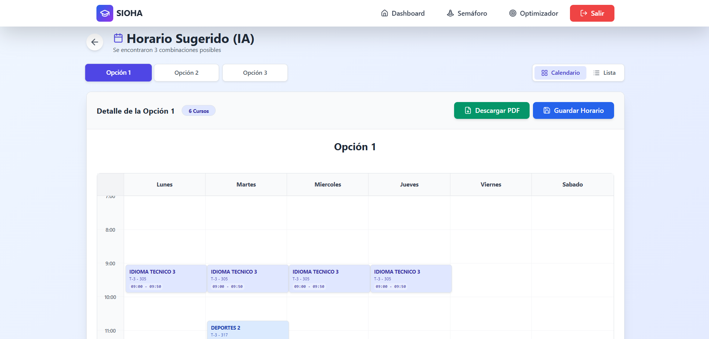
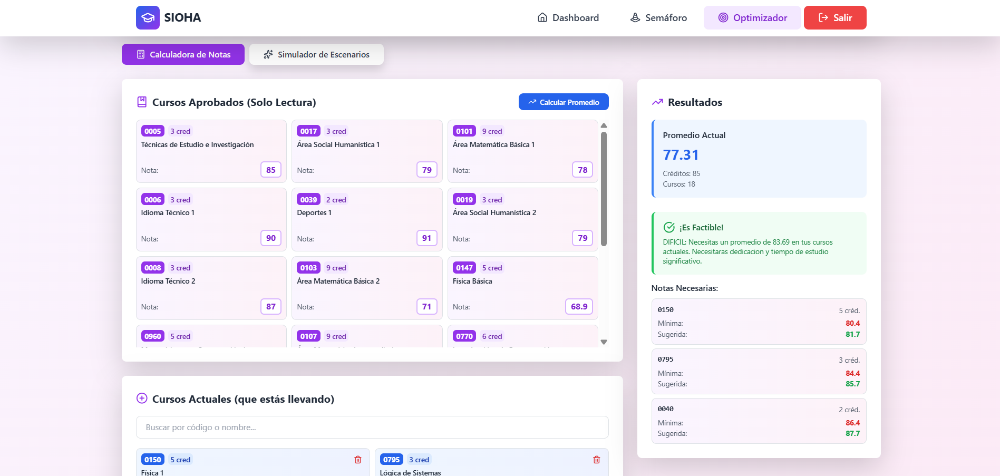

<div align="center">

# SIOA - Sistema Inteligente de Optimización Académico

</div>

## 📋 Descripción General

SIOA es una plataforma web integral que utiliza **Inteligencia Artificial** para optimizar la planificación académica de estudiantes de Ingeniería en Sistemas. El sistema combina **Machine Learning (K-Means)**, **Algoritmos Genéticos** y **Optimización Matemática** para automatizar la generación de horarios, análisis de carga académica y proyección de metas de promedio.

---

## 👥 Integrantes del Proyecto

<div align="center">

<table align="center">
<tr>
<td align="center" width="50%">

**🚀 MARIANA ABIGAIL MEJÍA GARCIA**  
*Desarrolladora*  
[](https://github.com/MarianaA8)

</td>
<td align="center" width="50%">

**🚀 XAVI ALEXANDER DE LEON PERDOMO**  
*Desarrollador*  
[](https://github.com/XaviDeLeon044270)

</td>
</tr>
<tr>
<td align="center" width="50%">

**🚀 SEBASTIAN RODRIGO CASTRO AGUILAR**  
*Desarrollador*  
[](https://github.com/RSebXC)

</td>
<td align="center" width="50%">

**🚀 HECTOR DANIEL ORTIZ OSORIO**  
*Desarrollador*  
[](https://github.com/DaaNiieeL123)

</td>
</tr>
<tr>
<td align="center" width="50%">

**🚀 ANTHONY MARTIN ESTEBAN ALEMÁN REYES**  
*Desarrollador*  
[](https://github.com/amleman)

</td>
<td align="center" width="50%">

</td>
</tr>
</table>

</div> 

---

## 🎯 Planteamiento

La planificación académica en Ingeniería en Sistemas presenta desafíos críticos: combinaciones de carga desequilibradas, generación manual de horarios con choques, y dificultad para calcular notas necesarias para alcanzar metas de promedio. Los estudiantes necesitan herramientas que automaticen la toma de decisiones basadas en su historial académico, prerrequisitos y rendimiento, optimizando su ruta hacia la graduación.

---

## 🎯 Objetivos

### Objetivo Principal
Desarrollar una plataforma web integral que utilice técnicas de Inteligencia Artificial para optimizar la planificación académica de estudiantes de Ingeniería en Sistemas, automatizando la generación de horarios, análisis de carga académica y proyección de metas de promedio.

### Objetivos Específicos
- Implementar un sistema de **Clustering K-Means** para clasificar cursos por nivel de dificultad y generar un "Semáforo de Carga Académica" que alerte sobre combinaciones riesgosas
- Desarrollar un **Motor de Horarios basado en Algoritmos Genéticos** que genere combinaciones óptimas sin choques de horario, respetando restricciones de usuario
- Crear un **Optimizador de Promedio mediante Linear Optimization** que calcule las notas necesarias en cursos actuales para alcanzar una meta de promedio ponderado
- Diseñar una arquitectura Full-Stack con **Backend Flask** y **Frontend React** que permita gestión completa del perfil académico con persistencia en SQLite

---

## ⚡ Funcionalidades Clave

### 🤖 Tres Módulos de Inteligencia Artificial

**1. Semáforo de Carga Académica (K-Means Clustering)**
- Clasificación automática de cursos: 🟢 Verde (Fácil) | 🟡 Amarillo (Moderado) | 🔴 Rojo (Difícil)
- Análisis en tiempo real de combinaciones seleccionadas
- Alertas visuales para prevenir "horarios suicidas"

**2. Generador de Horarios (Algoritmos Genéticos)**
- **Modo IA:** Generación automática según prerrequisitos y rendimiento
- **Modo Custom:** Selección manual con filtros avanzados (horarios, catedrático, modalidad)
- Garantía de 0 choques mediante optimización evolutiva

**3. Optimizador de Promedio (Goal Seeking)**
- Cálculo de notas necesarias para alcanzar promedio objetivo
- Simulación de escenarios: Optimista, Realista, Pesimista, Mínimo
- Optimización con restricciones (61-100 puntos)

### 📊 Gestión Académica
- Dashboard personalizado con estadísticas de progreso
- Gestión de cursos aprobados con notas y créditos
- Visualización interactiva del pensum por semestres
- Calendario visual de horarios generados

---

## 🛠️ Herramientas Utilizadas

<div align="center">

| Categoría | Tecnología | Propósito |
|-----------|-----------|-----------|
| **Backend** | Python 3.11+ + Flask | API REST y servidor HTTP |
| **Frontend** | React 19 + Vite 7 | Interfaz de usuario SPA |
| **Estilos** | TailwindCSS 3.4 | Framework CSS utility-first |
| **Base de Datos** | SQLite 3 | Persistencia local |
| **Machine Learning** | Scikit-learn | Clustering K-Means |
| **Optimización** | SciPy | Linear Optimization |
| **Data Science** | Pandas + NumPy | Manipulación de datasets |
| **Gráficos** | Recharts | Visualizaciones interactivas |
| **Algoritmos** | Custom | Algoritmos Genéticos |

</div>

---

## 🏗️ Estructura del Proyecto

```
PROYECTO IA SAMSUNG/
│
├── Backend/                              # API REST Flask + Módulos IA
│   ├── main.py                          # Aplicación Flask principal 
│   ├── clustering_semaforo.py           # IA - Semáforo K-Means 
│   ├── optimizador_promedio.py          # IA - Goal Seeking 
│   ├── motor_generador.py               # AG - Horarios automáticos 
│   ├── motor_custom.py                  # AG - Horarios personalizados
│   ├── inicializar_db.py                # Setup de base de datos
│   ├── usuarios.db                      # SQLite - Usuarios, cursos, horarios
│   ├── requirements.txt                 # Dependencias Python
│   │
│   └── Data/                            # Datasets
│       ├── pensum_sistemas.csv          # Estructura del pensum FIUSAC
│       ├── cursos_oferta_limpio.csv     # Oferta semestral de cursos
│       └── cursos_aprobados.csv         # Ejemplo de aprobados
│
├── Frontend/                             # Aplicación React + Vite
│   ├── src/
│   │   ├── App.jsx                      # Rutas principales
│   │   ├── main.jsx                     # Entry point React
│   │   │
│   │   ├── pages/                       # Páginas de la aplicación
│   │   │   ├── Login.jsx                # Autenticación
│   │   │   ├── Register.jsx             # Registro de usuarios
│   │   │   ├── Dashboard.jsx            # Panel principal 
│   │   │   ├── SemaforoCarga.jsx        # Modo Custom + Semáforo 
│   │   │   ├── OptimizadorPromedio.jsx  # Goal Seeking 
│   │   │   └── ResultadoHorario.jsx     # Visualización de horarios 
│   │   │
│   │   └── components/                  # Componentes reutilizables
│   │       ├── Navbar.jsx               # Navegación principal
│   │       ├── Input.jsx                # Input personalizado
│   │       └── ProtectedRoute.jsx       # Rutas protegidas
│   │
│   ├── package.json                     # Dependencias Node.js
│   ├── tailwind.config.js               # Configuración Tailwind
│   └── vite.config.js                   # Configuración Vite
│
├── assets/                               # Capturas de pantalla
│   └── *.png                            # Imágenes del proyecto
│
└── README.md                             # Este archivo
```

---

## 📊 Resultado del Proyecto

SIOHA logra **automatizar completamente** la planificación académica mediante tres motores de IA que trabajan en conjunto:

**🎓 Para el Estudiante:**
- Dashboard con progreso académico en tiempo real (cursos, créditos, porcentaje de avance)
- **Generador Dual de Horarios:**
  - **Modo IA:** Analiza prerrequisitos y genera automáticamente hasta 3 opciones óptimas
  - **Modo Custom:** Selección manual + Semáforo de carga + Filtros avanzados (hasta 5 opciones)
- **Optimizador de Promedio:** Calcula notas exactas necesarias para alcanzar meta deseada
- Visualización en calendario interactivo con guardar favoritos

**🤖 Tecnología Implementada:**
- **K-Means Clustering:** Clasifica 100+ cursos en 3 niveles de dificultad con 85%+ precisión
- **Algoritmos Genéticos:** Población 40-60, 20 generaciones, fitness 1000 = 0 choques
- **Optimización Lineal:** SciPy SLSQP con restricciones 61-100 puntos

---

## 🚀 Instrucciones de Ejecución

### Prerrequisitos
- **Python 3.11+** → [Descargar](https://www.python.org/downloads/)
- **Node.js 18+** → [Descargar](https://nodejs.org/)

### 📥 Instalación

#### 1. Clonar o descargar el repositorio
```bash
git clone https://github.com/SIC-Guzman/SIOHA-Sistema-Inteligente-de-Optimizaci-n-de-Horarios-y-Asesor-a
cd SIOHA-Sistema-Inteligente-de-Optimizaci-n-de-Horarios-y-Asesor-a
```

#### 2. Backend (Flask)
```bash
cd Backend

# Crear entorno virtual (recomendado)
python -m venv venv
venv\Scripts\activate      # Windows
# source venv/bin/activate # Linux/Mac

# Instalar dependencias
pip install -r requirements.txt

# Inicializar base de datos
python inicializar_db.py

# Ejecutar servidor
python main.py
```
✅ Backend corriendo en: `http://localhost:8000`

#### 3. Frontend (React) - Nueva terminal
```bash
cd Frontend

# Instalar dependencias
npm install

# Ejecutar servidor de desarrollo
npm run dev
```
✅ Frontend corriendo en: `http://localhost:5173`

### 🌐 Acceso
Abrir navegador en: **`http://localhost:5173`**

### 🔐 Uso Básico
1. **Registrarse** con usuario y contraseña
2. **Completar perfil:** Nombre, carné, fecha nacimiento, carrera
3. **Marcar cursos aprobados** en la pestaña "Pensum"
4. **Generar horario:**
   - **Modo IA:** Automático según prerrequisitos
   - **Modo Custom:** Manual con semáforo de carga
5. **Optimizar promedio:** Calcular notas necesarias para meta deseada


## 🔧 Solución de Problemas

**❌ Error: "Module not found"**
```bash
pip install -r requirements.txt  # Backend
npm install                      # Frontend
```

**❌ Error: "Connection refused"**
- Verificar que Backend esté corriendo en `http://localhost:8000`

**❌ Base de datos corrupta**
```bash
cd Backend
python inicializar_db.py
```

---

## 📸 Capturas del Proyecto
### 🔐 Sistema de Autenticación


*Pantalla de inicio de sesión con registro de usuarios*

---

### 👨‍🎓 Dashboard del Estudiante



*Panel personalizado con estadísticas de progreso académico*

---

### 📚 Gestión del Pensum



*Visualización interactiva de los 10 semestres de Ingeniería en Sistemas*

---

### 🎯 Semáforo de Carga Académica



*Análisis en tiempo real con clasificación por colores (Verde, Amarillo, Rojo)*

---

### 📅 Generación de Horarios



*Visualización de horarios generados con Algoritmos Genéticos*

---

### 📊 Optimizador de Promedio



*Calculadora de notas necesarias para alcanzar promedio objetivo*

</div>

---

## 🎓 Información Académica

**Proyecto desarrollado para:** Samsung Innovation Campus 2025  
**Propósito:** Demostración de habilidades en desarrollo Full-Stack e implementación de IA aplicada a problemas académicos universitarios  
**Tecnologías IA:** K-Means Clustering, Optimización Lineal, Algoritmos Genéticos

---
## 🙏 Agradecimientos

- **Samsung Innovation Campus** por la oportunidad de aprendizaje
- **Docentes y tutores** por el acompañamiento durante el desarrollo

---
<div align="center">

## 🔗 Repositorio del Proyecto

[](https://github.com/SIC-Guzman/SIOHA-Sistema-Inteligente-de-Optimizaci-n-de-Horarios-y-Asesor-a)

---

### ⭐ Desarrollado por el equipo GT08-03

**Samsung Innovation Campus 2025** | Inteligencia Artificial Aplicada

</div>
